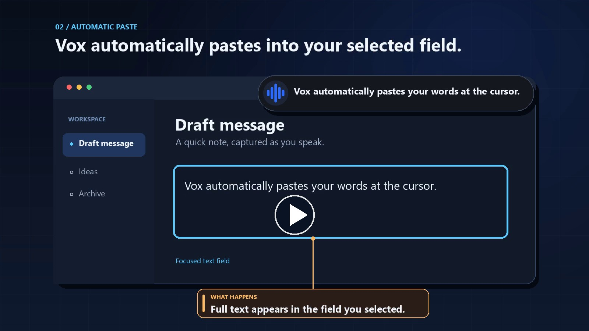

# Vox Native Transcription

A Windows desktop speech-to-text tool with real-time transcription streaming. Press a hotkey and speak; the final result is copied to the clipboard and pasted into a confirmed focused text field.

[](https://github.com/bekhruz-ti/vox-native-transcription/actions)

## Demo

Click the preview to watch the 30-second product demo.

[](https://raw.githubusercontent.com/BekhruzT/vox-native-transcription/main/docs/media/vox-product-demo.mp4)

[Watch the video (MP4)](https://raw.githubusercontent.com/BekhruzT/vox-native-transcription/main/docs/media/vox-product-demo.mp4)

## Features

- **Global Hotkey** — Press `Win+Alt+J` from anywhere to start/stop recording
- **Real-time Streaming** — See your words transcribed as you speak
- **Text Delivery** — Copies the final transcription and pastes into a confirmed focused text field
- **Floating Toast** — Beautiful notification showing live transcription
- **Manual Paste** — When no text field is confirmed, select a destination and press `Ctrl+V`
- **System Tray** — Runs quietly in the background
- **Multiple Providers** — Supports ElevenLabs and OpenAI transcription APIs

## Download

Get the latest release from the [Releases page](https://github.com/bekhruz-ti/vox-native-transcription/releases):

- **`Vox-Setup-X.Y.Z.exe`** — Windows installer (recommended)
- **`Vox-Portable-X.Y.Z.zip`** — Portable version, no installation required

## Setup

### 1. Get an API Key

You need an API key from one of these providers:

| Provider | Get API Key | Notes |
|----------|-------------|-------|
| **ElevenLabs** (recommended) | [elevenlabs.io](https://elevenlabs.io) | Better real-time streaming |
| **OpenAI** | [platform.openai.com](https://platform.openai.com) | Whisper-based transcription |

### 2. Configure the API Key

Create a `.env` file in the app directory or set an environment variable:

**Option A: Environment Variable**
```
ELEVENLABS_API_KEY=your_key_here
```
or
```
OPENAI_API_KEY=your_key_here
```

**Option B: .env File**

Create a file named `.env` next to the executable:
```
ELEVENLABS_API_KEY=your_key_here
```

### 3. Run the App

Launch `Vox.exe`. You'll see a waveform icon appear in your system tray.

## Usage

| Action | How |
|--------|-----|
| **Start Recording** | Press `Win+Alt+J` or double-click the tray icon |
| **Stop Recording** | Press `Win+Alt+J` again |
| **Copy Transcription** | Click the toast notification |
| **Where text goes** | Clipboard, plus automatic paste into a confirmed focused text field |
| **Open Settings** | Right-click tray icon → Settings |
| **Exit** | Right-click tray icon → Exit |

### Text Delivery

Vox shows live transcription in the toast. When recording finishes, it copies the
complete result to the clipboard. If the text field focused when recording began
is still focused, Vox pastes the result into it in one operation. The result stays
on the clipboard so `Ctrl+V` can paste it again.

If no text field was selected or focus changed, Vox sends no paste shortcut. Select
a destination and press `Ctrl+V`; clicking the toast also copies its full result.
Some Chromium and Electron editors do not identify their text fields reliably to
Windows UI Automation, so they may use this manual paste fallback.

## Configuration

Settings are stored in `%APPDATA%\InputSTT\settings.json`:

| Setting | Default | Description |
|---------|---------|-------------|
| `hotkey` | `Win+Alt+J` | Global hotkey to toggle recording |
| `language` | `en` | Transcription language code |
| `audio_device` | System default | Microphone to use |

## Building from Source

### Prerequisites

- Python 3.11+
- Windows 10/11
- Git

### Development Setup

```powershell
# Clone the repository
git clone https://github.com/bekhruz-ti/vox-native-transcription.git
cd vox-native-transcription

# Create virtual environment
python -m venv venv
.\venv\Scripts\Activate.ps1

# Install dependencies
pip install -r requirements.txt

# Run the app
python main.py
```

### Build Installer Locally

```powershell
# Activate virtual environment
.\venv\Scripts\Activate.ps1

# Install PyInstaller
pip install pyinstaller

# Build with PyInstaller
pyinstaller vox-native-transcription.spec

# The app is now in dist\Vox\
# Run it to test:
.\dist\Vox\Vox.exe
```

To create the installer (requires [Inno Setup](https://jrsoftware.org/isdl.php)):

```powershell
# Build the installer
& "C:\Program Files (x86)\Inno Setup 6\ISCC.exe" installer.iss

# The installer is now at dist\Vox-Setup-X.Y.Z.exe
```

## Known Limitations

- **Windows only** — Uses Windows-specific APIs for focus detection and paste shortcuts
- **Admin may be required** — Global hotkeys work best when running as administrator
- **API key required** — Transcription requires a valid ElevenLabs or OpenAI API key

## License

MIT License — see [LICENSE](LICENSE) for details.

